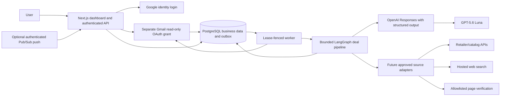

# Comprador technical design

## 1. Goals

- Ingest only shopping email the user intentionally provides.
- Extract offer terms into auditable structured records.
- Compare promotions against a clearly defined observed history.
- Research products through bounded, approved sources.
- Coordinate multi-item projects under shared constraints.
- Keep business state independent of agent execution state.
- Make model and source uncertainty visible.
- Require approval before any future external or irreversible action.

## 2. Recommended stack

| Layer               | Choice                          | Why                                                                         |
| ------------------- | ------------------------------- | --------------------------------------------------------------------------- |
| Language            | TypeScript                      | One language across UI, domain, connectors, and graphs                      |
| Web                 | Next.js App Router              | Dashboard, auth, route handlers, and streaming UI                           |
| UI                  | Tailwind CSS and shadcn/ui      | Fast, accessible product UI without a custom design system                  |
| Database            | PostgreSQL and Prisma           | Relational offer history, product identity, constraints, and audit records  |
| Agent orchestration | LangGraph.js                    | Explicit, bounded extraction and scoring steps                              |
| Model layer         | OpenAI Responses SDK            | Strict structured output with `store: false`                                |
| Background runtime  | TypeScript worker               | PostgreSQL-backed jobs, retries, and Gmail polling                          |
| LLM                 | OpenAI GPT-5.6 family           | A current three-tier family plus Responses web search and structured output |
| Email MVP           | Gmail API with `gmail.readonly` | Direct value for the owner while preserving least privilege                 |
| Source retention    | In-memory body processing       | No durable raw MIME or HTML in the first implementation                     |
| Web hosting         | Vercel candidate                | Next.js UI, authenticated API, and Pub/Sub endpoint                         |
| Observability       | Redacted application metrics    | Latency, failures, cost, and product telemetry without message bodies       |

PostgreSQL is the durable system of record. A managed graph runtime or tracing
provider is not required for the personal-use phase and should be introduced
only after its privacy and operational value is measured.

## 3. Architecture



The browser never receives a Gmail refresh token, Google client secret, OpenAI
key, or encryption key. Authenticated routes derive `userId` from the server
session. Background jobs retain that identity and every database lookup is
scoped through the connection or user.

Raw email is normalized and filtered in worker memory. Only the sanitized text
needed for a single extraction enters graph state. The application persists
message metadata, normalized offers, and minimal evidence, not raw bodies.
Model requests set `store: false`.

The Gmail callback transactionally saves the encrypted grant and an initial-sync
job. Pub/Sub and polling enqueue incremental-sync jobs. The worker fetches and
processes bodies asynchronously and idempotently.

## 4. Repository shape

```text
apps/
  web/                 Next.js UI, auth, Gmail OAuth, Pub/Sub route
  worker/              Outbox worker and Gmail synchronization
packages/
  agent/               LangGraph deal pipeline and OpenAI extraction
  core/                Zod schemas, local filter, scoring, comparison
  database/            Prisma schema, migration, and client
  gmail/               OAuth, token encryption, API, message normalization
```

Start with these boundaries but keep packages small. Do not create a repository,
service, or deployable unit for every entity or graph node.

## 5. Model strategy

OpenAI is initial because GPT-5.6 has explicit tiers and Responses supplies
structured output. The first graph uses the OpenAI SDK directly and gives the
extraction step no tools.

| Role              | Model           | Initial effort | Work                                                  |
| ----------------- | --------------- | -------------- | ----------------------------------------------------- |
| Bulk extraction   | `gpt-5.6-luna`  | low            | Promo classification, term extraction, normalization  |
| Default reasoning | `gpt-5.6-terra` | low/medium     | Requirement interpretation, comparison, explanation   |
| Exception path    | `gpt-5.6-sol`   | medium         | Conflicting evidence or difficult bundle adjudication |

Escalation is based on schema failure, missing critical fields, conflicting
sources, or measured task difficulty. It is not based on a vague confidence
sentence generated by the same model.

Use Zod schemas for every model-to-code boundary. Preserve raw provider metadata
needed for token usage, citations, refusals, and actual returned model. Keep a
small provider interface so a Claude candidate selected at evaluation time can
run against the same corpus without changing domain logic.

OpenAI pricing on July 30, 2026 was:

| Model | Short-context input / 1M | Output / 1M |
| ----- | -----------------------: | ----------: |
| Luna  |                    $0.20 |       $1.20 |
| Terra |                    $2.00 |      $12.00 |
| Sol   |                    $5.00 |      $30.00 |

At 2,000 input and 300 output tokens, a Luna extraction is about $0.00076
before other services. Search and product-data calls can dominate cost. Historic
backfills can use Batch after correctness is established; current official batch
rates are half the standard token rates. Recheck all prices before building.

## 6. Workflows

### Deal-intake graph

```text
Gmail sync
→ deduplicate by connection and provider message ID
→ normalize MIME and strip HTML links/images
→ locally filter sensitive and transactional mail
→ classify promotional content through a minimal-content path
→ discard or quarantine non-promotional content
→ extract ambiguous terms to a Zod schema
→ validate and normalize merchant/offer
→ find comparable observed offers
→ calculate eligibility, effective value, and rank in code
→ generate an explanation only when surfaced
→ persist and optionally notify
```

The extraction node has no browser, send, navigation, purchase, or general tool.
Email content is untrusted data and cannot authorize an action.

### Product-research graph

```text
validate item brief
→ ask only blocking questions
→ create capped queries
→ fan out to approved source adapters
→ normalize products and listings
→ deduplicate exact variants
→ remove hard-constraint failures
→ verify top candidates' current facts
→ rank deterministically
→ generate a sourced comparison
→ evidence audit
→ persist three candidates
```

Default run limits:

- five search queries;
- twenty discovered listings;
- five fully verified candidates;
- three recommendations;
- one retry per transient source;
- a per-run search and model budget;
- user-visible cancellation.

### Project graph

```text
validate project brief
→ propose item requirements and budget allocation
→ interrupt for user review
→ run item-research subgraphs in parallel
→ optimize the bundle under shared hard constraints
→ review style and compatibility
→ audit evidence and budget
→ produce the purchase plan
```

LangGraph subgraphs are appropriate for parallel item research. A free-running
agent swarm is not. A future purchase node must be separate, idempotent, and
preceded by an interrupt. LangGraph nodes restart from the beginning when
resumed, so side effects before an interrupt are unsafe.

## 7. Core data model

| Entity                                    | Purpose                                                            |
| ----------------------------------------- | ------------------------------------------------------------------ |
| `User`                                    | Auth.js identity and application owner                             |
| `Account`, `Session`, `VerificationToken` | Auth.js persistence                                                |
| `ConsentGrant`                            | Versioned Gmail and model-processing consent                       |
| `GmailConnection`                         | Encrypted tokens, Gmail identity, sync cursor, watch state         |
| `OutboxJob`                               | Transactional asynchronous work with idempotency and lease state   |
| `GmailMessage`                            | Gmail IDs, safe headers, status, and processing outcome            |
| `Offer`                                   | Normalized promotion, score components, and bounded history result |
| `Evidence`                                | Redacted claim excerpt, field path, and validation level           |
| `ShoppingIntent`                          | Owner-entered buying need and constraints                          |
| `OfferMatch`                              | Deterministic offer-to-intent fit                                  |
| `AgentRun`                                | Model/schema versions, status, timing, and failure                 |

Use decimal money fields and ISO currency codes. Important uniqueness constraints
include Gmail message ID per connection and idempotency key per background job.
Offer extraction is upserted by message so a retry cannot create duplicate
business records.

A vector database is not needed initially. Structured relational filters and
history are more important than semantic retrieval. Add embeddings only after a
measured need such as preference similarity or campaign deduplication.

## 8. Source adapters

Use a common adapter contract returning retrieval metadata and evidence for each
claim, rather than one unexplained confidence number:

```ts
type EvidenceRef = {
  claimPath: string;
  sourceId: string;
  sourceKind: "email" | "api" | "search" | "page" | "user";
  sourceUrl?: string;
  observedAt: string;
  redactedExcerpt?: string;
  anchor?: string;
  excerptHash: string;
  validation: "direct" | "derived" | "unverified";
};

type SourceResult<T> = {
  data: T;
  retrieval: {
    adapter: string;
    method: string;
    queryId: string;
    retrievedAt: string;
    freshness: "live" | "recent" | "unknown";
  };
  evidence: EvidenceRef[];
};
```

The application derives claim status from evidence type, freshness, agreement,
and required-field rules. A model or adapter cannot certify its own output with
an overall confidence scalar.

Initial source order:

1. user-provided product URL;
2. merchant or licensed catalog API;
3. eBay Browse and Best Buy Products for supported categories;
4. OpenAI hosted web search for discovery, with visible citations;
5. allowlisted product-page structured data for verification;
6. a licensed price-history source where its coverage and terms fit.

Do not make generic scraping the foundation. Retailer markup, access, terms, and
anti-bot behavior make it brittle. The Best Buy API exposes current and
historical catalog data; eBay Browse supports listing search. Neither makes
coverage universal. Amazon data must use a current permitted program or licensed
provider, not an assumed public catalog API.

## 9. Email strategy

Direct Gmail is the initial and only email connector. Identity login and Gmail
authorization remain separate. The grant is read-only, encrypted at rest, and
revocable; local polling and manual sync work before Pub/Sub is configured.
Cursor recovery, URL isolation, history coverage, and disconnect deletion are
specified in the [email integration plan](email-integration.md).

## 10. Trust and quality

Security, prompt-injection boundaries, privacy, observability, evals, the
verification matrix, and operational risks are specified in the
[trust and quality plan](trust-and-quality.md).
